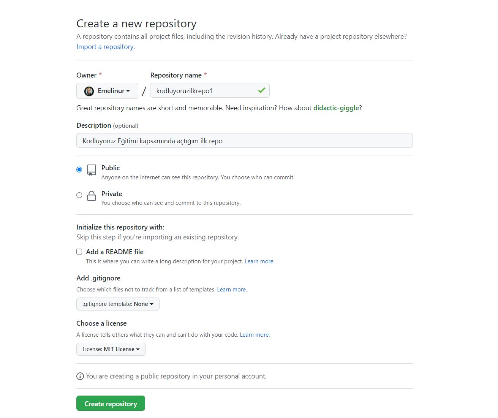

# Kodluyoruz İlk Repo
Bu repo [kodluyoruz](https://kodluyoruz.org/) Front-End Eğitiminde oluşturduğumuz ilk repo.İçerisinde bir adet README dosyası, bir adet index.html barındırıyor.



## Installation
Öncelikle projeyi clonelayın.

```
https://github.com/Emelinur/kodluyoruzilkrepo.git
```

### Usage
Projeyi cloneladıktan sonra Visual Studio Code programında açınız.

Lunix için:

```
cd kodluyoruzilkrepo
code .
```
### Contributing
pull requestler kabul edilir.Büyük değişikler için,lütfen neyi değiştirmek istdiğiniz tatışmak için bir konu açınız.

## License
[MIT](https://choosealicense.com/licenses/mit/)

